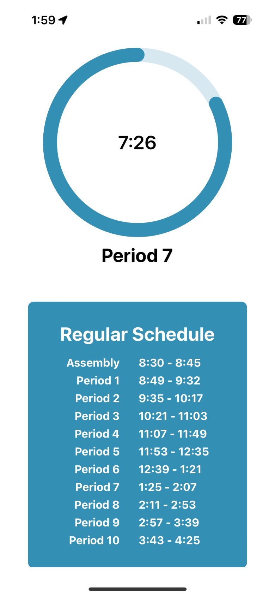
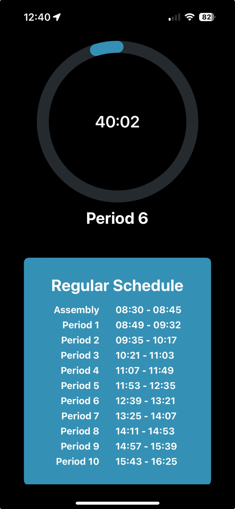
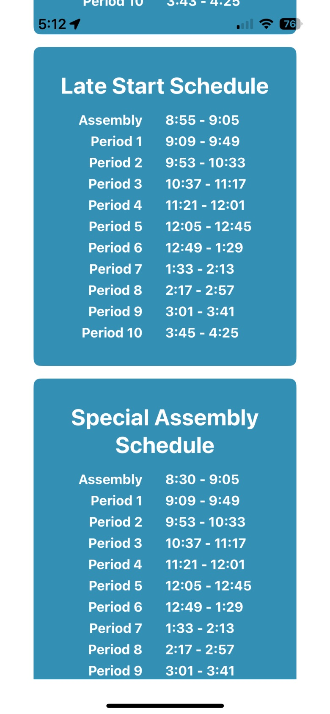
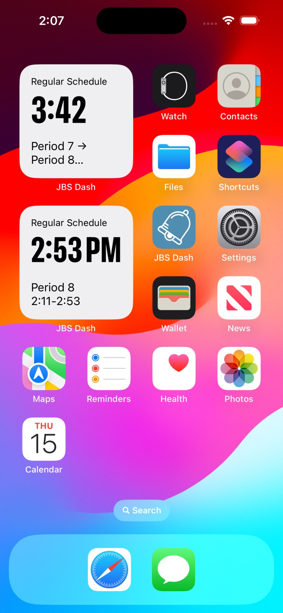
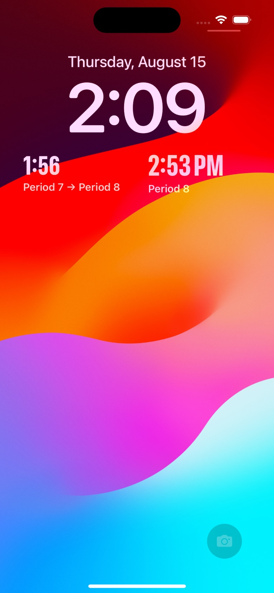
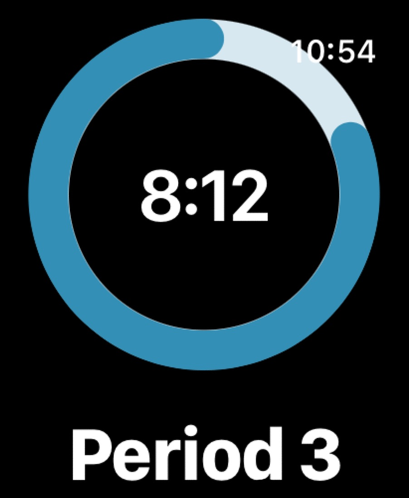
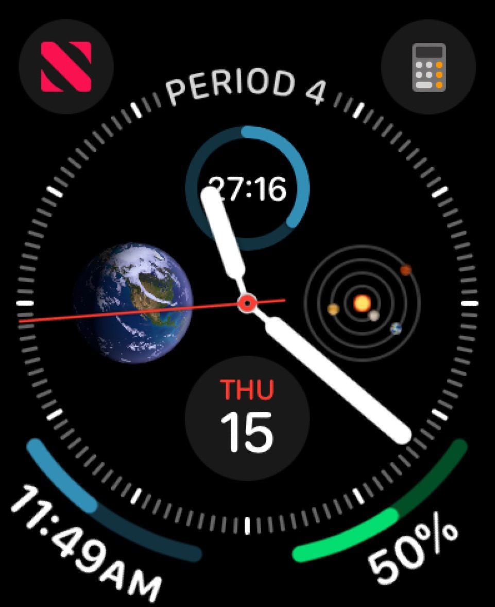

# JBS Dash

A native SwiftUI app for iPhone, Apple Watch, and Mac that answers one question as fast as possible: **how much time is left in this period?**

My school runs a rotating bell schedule (regular days, late starts, assembly days) which make that question surprisingly annoying to answer. JBS Dash pulls the day's schedule from a school-schedule API, caches it locally, and renders a live countdown ring plus a set of Home Screen, Lock Screen, and watch-face widgets so you never have to open an app at all.

> Built with ❤️ by [Dalton Harrold](https://github.com/daltonharrold). The project ships against one school's schedule API, but the API contract is small and generic — see [The API](#the-api).

---

## Screenshots

<table>
  <tr>
    <td align="center" width="33%">
      
      <br><sub><b>Today at a glance</b><br>12-hour locale</sub>
    </td>
    <td align="center" width="33%">
      
      <br><sub><b>Dark mode</b><br>24-hour locale</sub>
    </td>
    <td align="center" width="33%">
      
      <br><sub><b>Every day type</b><br>today's floated to the top</sub>
    </td>
  </tr>
  <tr>
    <td align="center">
      
      <br><sub><b>Home Screen widgets</b><br>countdown and end time</sub>
    </td>
    <td align="center">
      
      <br><sub><b>Lock Screen widgets</b><br>passing period and end time</sub>
    </td>
    <td></td>
  </tr>
  <tr>
    <td align="center">
      
      <br><sub><b>Watch app</b><br>the same ring, wrist-sized</sub>
    </td>
    <td align="center">
      
      <br><sub><b>Complications</b><br>corner, circular, and inline</sub>
    </td>
    <td></td>
  </tr>
</table>

---

## What it does

- **Live period countdown.** A progress ring showing the time left in the current period, counting down by the second. It understands passing periods too, displaying them as `Period 3 → Period 4`.
- **Knows when school isn't in session.** Before the first bell and after the last one the ring hides itself (or, on the Watch, says "School not in session!").
- **Today's schedule, plus every other schedule.** The app lists all of the school's day types as cards, with today's floated to the top.
- **Widgets everywhere.** Two widgets, each built for every platform:
  - **Time Left in Period** — the countdown at a glance.
  - **Period End Time** — just the clock time the period ends, for people who'd rather read their own watch.
- **Works offline.** Schedules for the next 7 days are fetched ahead of time and stored in Core Data, so the app and its widgets keep working without a network connection.
- **Keeps itself fresh.** A daily `BGProcessingTask` refreshes the cache in the background; widget timelines are pre-built for the whole school day, so they tick over without waking the app.
- **Respects your locale.** Times render as 12- or 24-hour based on the system clock setting.

## Platforms

| Target | Platform | Minimum OS |
| --- | --- | --- |
| `NativeDash` | iOS | 16.0 |
| `NativeDash Watch App` | watchOS | 9.0 |
| `NativeDash Mac App` | macOS | 14.0 |
| `DashWidgetsExtension` | iOS widgets | 17.0 |
| `DashWatchWidgetsExtension` | watchOS complications | 10.0 |
| `DashMacWidgetsExtension` | macOS widgets | 14.5 |

Supported widget families: `systemSmall`, `accessoryRectangular`, `accessoryCircular`, `accessoryCorner`, and `accessoryInline`, varying by platform.

---

## How it works

```
   School schedule API
            │  (7 requests: today + 6 days ahead)
            ▼
     FetchUtil / BackgroundFetchUtil      ← Operation-based, concurrent
            │
            ▼
   Core Data (NSPersistentCloudKitContainer)
   stored in a shared App Group container
            │
     ┌──────┴────────┬──────────────┐
     ▼               ▼              ▼
  iOS app        Mac app      Widget extensions
  Watch app                   (read-only timelines)
```

**Fetching.** `FetchUtil` runs a `FetchOperation` (parallel `URLSession` data tasks for today and the next six days) followed by a `StoreOperation` that replaces the cached day types and re-links each date to its schedule — all built on a custom `GenericAsyncOperation` base class with proper KVO state handling and cancellation/rollback. `BackgroundFetchUtil` is the counterpart for background execution: it uses a background `URLSession` with download tasks so the OS can hand results back even if the app is suspended.

**Storage.** Three Core Data entities, in a store placed in the `group.com.icloud-djharrold53.NativeDash` App Group container so the widget extensions can read it directly:

| Entity | Fields |
| --- | --- |
| `StoredDayType` | `name`, ordered `periods`, `datesUsingSchedule` |
| `StoredPeriod` | `name`, `start`, `end`, `schedule` |
| `StoredScheduleOnDate` | `date`, `schedule` |

The container is an `NSPersistentCloudKitContainer`, so the cache syncs through the user's private CloudKit database.

**Widget timelines.** Rather than polling, each widget pre-computes the entire day as a timeline: a midnight "Good morning" entry, a 15-minute "School starting..." countdown, one entry per period, one per passing period, and an end-of-day "Good night" entry that shows tomorrow's start time. If the widget finds no cached schedule for today it kicks off a background fetch and returns a timeline that reloads immediately afterward.

**Logging.** All logging goes through `OSLog` with per-area categories (`fetch`, `coreData`, `widget`, `background`, `other`) defined in `Configuration/LoggingConfiguration.swift`, so you can filter in Console.app by subsystem and category.

---

## Project layout

```
NativeDash/              iOS app — ContentView, PeriodTimerRing, ScheduleStack, SingleCard
NativeDash Watch App/    watchOS app
NativeDash Mac App/      macOS app (reuses ContentView)
DashWidgets/             TimerWidget + EndTimeWidget — shared by all three widget extensions
DashMacWidgets/          macOS widget bundle
DashWatchWidgets/        watchOS widget bundle
Models/                  DataStructs (DayType, Period, time math), FetchUtil, AppGroup
CoreDataStore/           PersistenceController, NSManagedObject subclasses, .xcdatamodeld
Configuration/           xcconfig template, entitlements, privacy manifest, logging setup
APIreturn.json           A captured API response, handy as a fixture/reference
```

The three apps share the same `ContentView`, `PeriodTimerRing`, model layer, and persistence stack; platform differences are handled with `#if os(...)` rather than forked files.

---

## Building

**Requirements:** Xcode 15+, an Apple Developer account (the app needs App Group, CloudKit, Push, and Background Processing capabilities), and access to a school-schedule API.

1. **Clone and create your config file.** The project's base configuration points at `Configuration/EnvProduction.xcconfig`, which is gitignored. Copy the template:

   ```sh
   cp Configuration/EnvTemplate.xcconfig Configuration/EnvProduction.xcconfig
   ```

   Then fill in your own values:

   ```
   API_ENDPOINT=api.example.com/api/v1
   API_KEY=Bearer your-token-here
   SCHOOL_ID=your-school-id
   ```

   These are injected into each target's `Info.plist` under `LSEnvironment` and read back at runtime via `Bundle.main.infoDictionary`.

2. **Update the identifiers.** Bundle IDs, the App Group (`group.com.icloud-djharrold53.NativeDash`), the iCloud container, and the background task identifier `com.icloud-djharrold53.NativeDash.DayTypeUpdater` are all hardcoded to the original developer's team. Swap them for your own in the target settings, entitlements files, and `Models/AppGroup.swift`.

3. **Pick a scheme and run.** `NativeDash iOS App`, `NativeDash Watch App`, and the widget extension schemes are shared. `School Dash API` and `Local API` are iOS variants for pointing at a deployed vs. locally running backend.

### Debugging tips

Background refresh is hard to wait for. To trigger or expire the daily task on demand, pause in the debugger and run:

```
e -l objc -- (void)[[BGTaskScheduler sharedScheduler] _simulateLaunchForTaskWithIdentifier:@"com.icloud-djharrold53.NativeDash.DayTypeUpdater"]
e -l objc -- (void)[[BGTaskScheduler sharedScheduler] _simulateExpirationForTaskWithIdentifier:@"com.icloud-djharrold53.NativeDash.DayTypeUpdater"]
```

The `School Dash API` scheme already enables `com.apple.CoreData.ConcurrencyDebug`.

---

## The API

One authenticated `GET`, with the date as query parameters:

```
GET https://{API_ENDPOINT}/schools/{SCHOOL_ID}?includes=dayTypeOnDate&day=7&month=10&year=2026
Authorization: {API_KEY}
```

The response only needs three fields for the app to work — the schedule in effect on the requested date, and the full list of the school's schedules:

```jsonc
{
  "_id": "…",
  "name": "JBS",
  "dayTypeOnDate": {
    "name": "Late Start Schedule",
    "periods": [
      { "name": "Assembly", "start": "08:55", "end": "09:05" },
      { "name": "Period 1", "start": "09:09", "end": "09:49" }
    ]
  },
  "dayTypes": [
    { "name": "Regular Schedule",          "periods": [ /* … */ ] },
    { "name": "Late Start Schedule",       "periods": [ /* … */ ] },
    { "name": "Special Assembly Schedule", "periods": [ /* … */ ] },
    { "name": "Common Day",                "periods": [ /* … */ ] }
  ]
}
```

Times are `"HH:mm"` strings on a 24-hour clock, and periods are assumed to be in chronological order. `APIreturn.json` in the repo is a full captured response if you want to see the real shape or stand up a mock.

---

## Privacy

The app sends no personal data anywhere. It makes read-only requests to the schedule API, stores the results locally and in the user's own private CloudKit database, and records a single `UserDefaults` counter for background-task runs (declared in `Configuration/PrivacyInfo.xcprivacy`).

## Status

Actively developed from September 2023 through September 2024 across ~100 commits; the iOS, watchOS, and macOS apps and all six targets build and ship. `NativeDash/SchedulesView.swift` is an unused stub left over from early scaffolding.
